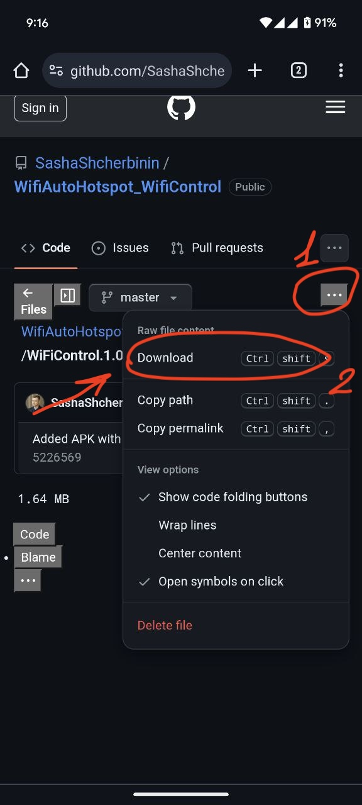
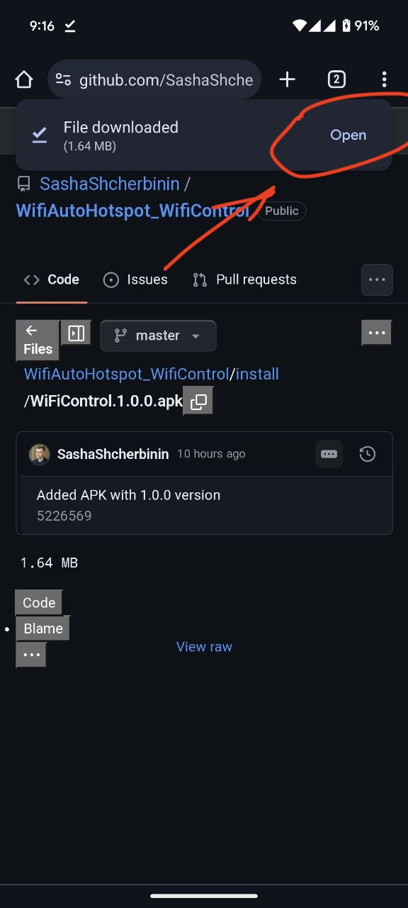
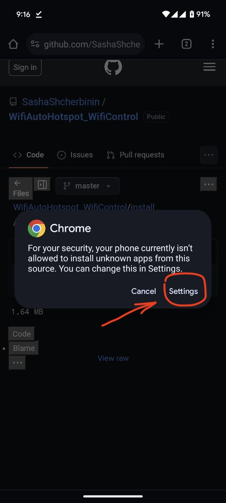
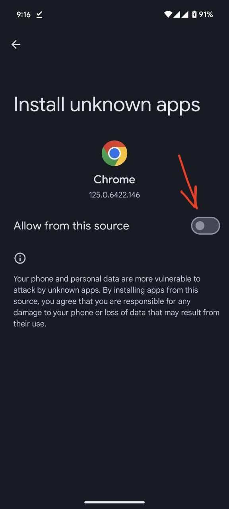
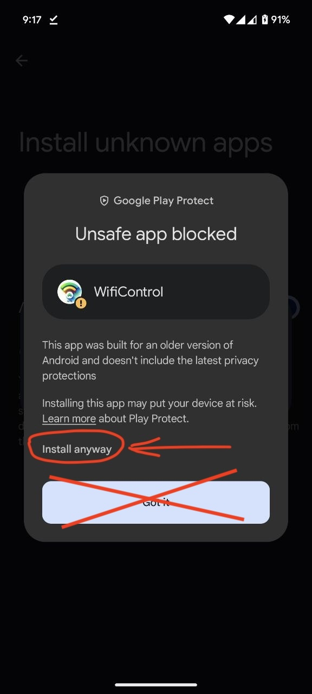

# How to install

1. Download the latest APK from the [WiFiControl.1.1.3.apk](https://github.com/SashaShcherbinin/WifiAutoHotspot_WifiControl/releases/download/1.1.3/WiFiControl.1.1.3.apk)

2. Open it in you android phone

3. You’ll receive a warning letting you know that you must give that app permission to install the file.
4. Tap the Settings button to proceed.

5. Allow installation from unknown sources.

6. Allow to install it

# What the reason it is not in the market

It has a low compatibility version that makes it possible to turn the Wi-Fi on and off.
Because of that, it is impossible to upload it to the market.
This app has an open-source code that shows it is secure.
